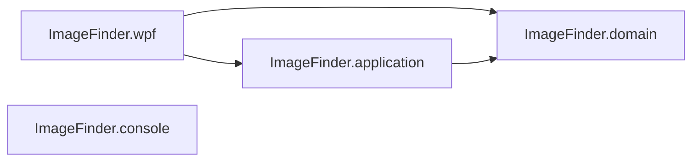

# Image Finder

Image Finder is a Windows WPF app that scans a source directory for images and copies them into an organised `Year/Month` folder structure using the image's EXIF "Date Taken" metadata. A simple console client is still available for quick command-line sorting.

## Solution layout

- `ImageFinder.wpf` — Primary WPF UI, built with MVVM (CommunityToolkit.Mvvm).
- `ImageFinder.application` — Core logic: scanning, EXIF parsing and file organisation.
- `ImageFinder.domain` — Domain models and supported image extensions.
- `ImageFinder.console` — Legacy console app for quick runs.

### Project relationships



### Key behaviour

- Supported extensions: `.jpg`, `.jpeg`, `.png`, `.gif`, `.bmp`, `.tiff`.
- Images are grouped into `Destination/{Year}/{Month}` based on EXIF "Date Taken".
- Files with duplicate names gain a short GUID suffix to avoid overwriting.
- Files without EXIF dates (or with invalid EXIF) are copied to `Destination/Unsorted`.
- EXIF metadata is preserved during copy (including location/date if present).
- Progress is reported via `IProgress<double>` and surfaced in the WPF UI.

### Unsorted images

When a file does not contain a usable EXIF date, Image Finder still copies it and places it under an `Unsorted` path in the destination directory. This keeps unmatched files visible for manual review instead of dropping them.

## Setup

1. Install the .NET 10 SDK (for `ImageFinder.wpf`, `ImageFinder.application`, and `ImageFinder.domain`). The console app targets .NET 8 if you prefer the stable SDK there.
2. On Windows, restore and build the solution:

   ```bash
   dotnet restore
   dotnet build ImageFinder.sln
   ```

   The WPF project requires Windows (uses `net10.0-windows7.0`, Windows Forms folder picker, and WPF).

All required NuGet packages (`MetadataExtractor`, `CommunityToolkit.Mvvm`) are already referenced.

## CI workflow

The repository includes a GitHub Actions workflow at `.github/workflows/ci.yml` that runs on pushes and pull requests to `main`.

Checks currently include:

- Conventional commit validation for pull request commits.
- `dotnet format --verify-no-changes` for C# formatting.
- `prettier --check` for JSON/YAML/Markdown files.
- `dotnet build` with warnings treated as errors.
- `dotnet test` when test projects are detected.

## Pre-commit hooks

This repository includes `.pre-commit-config.yaml` to enforce local checks before code reaches CI.

Configured hooks:

- YAML and whitespace hygiene checks.
- Conventional commit message validation (`commit-msg` hook).
- Prettier formatting checks for JSON/YAML/Markdown.
- `dotnet format --verify-no-changes` for C# files.

Example setup:

```bash
pip install pre-commit
pre-commit install --hook-type pre-commit --hook-type commit-msg
pre-commit run --all-files
```

## Usage

WPF app (recommended):

- Run the UI: `dotnet run --project ImageFinder.wpf`
- Select a source folder and a destination folder, then press **Start**.
- Watch the progress bar update; use **Start over** to reset selections.

Console app:

- Run `dotnet run --project ImageFinder.console`.
- Provide source and destination paths when prompted; files are copied into `Year/Month` folders.

## Contributing

Contributions, bug reports and suggestions are welcome. Please follow the project relationships above to keep the architecture clean.

## Testing

Unit tests were removed with the move away from the original console-first design. The plan is to reintroduce tests around `ImageFinder.application` so UI clients stay thin and testable.

## License

This project is licensed under the MIT License. See the LICENSE file for details.

## Contact

For questions or feature requests, please open an issue or discussion on the GitHub repository.
